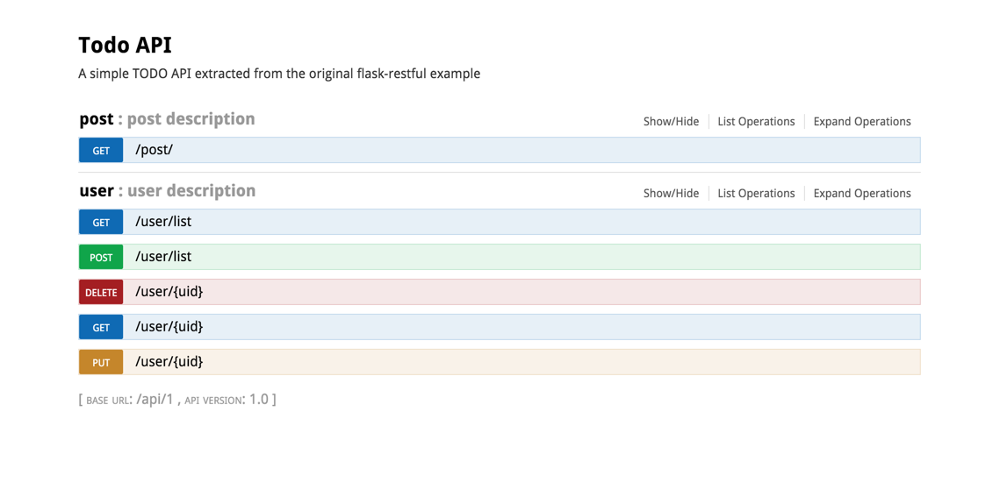

## Ready


### **Install**


for npm(using npm3)

``` sh
npm install
```


for pip(I assume you are using  [virtualenv](https://virtualenv.readthedocs.org/en/latest/))

``` sh
pip install -r requirements.txt
```


## Dev


#### For Front-end

create a webpack server (Time-saving synchronised browser testing.)

``` javascript
npm run dev
```


open `localhost:8080` , you will see the front page


#### For Back-end

at the same time,  we need make server by a commad below :

``` 
python run.py 
```


open `localhost:5000/api/1/` , you will see：




## Product


the first one , we run command here

``` sh
npm run build # build.js file created in static dir
```


then we just change the `DEBUG` variable to false which in config.py


## To Do List


- Improve my english


## 中文补充

英文不好，这里做中文补充...


正文:

目前这是一个将 flask 与 [vuejs]('https://github.com/vuejs/vue') 结合的尝试。前端构建使用webpack，喜欢它的 hot-loader 以及很好的

结合 [vue-loader]('https://github.com/vuejs/vue-loader') 。 后端部分提供 Restful API ，其内容上面图片已经展示了，也可以自行clone下来运行。


#### 开发环境

平时如果只想开发前端页面只需要 `npm run dev`  ，打开`localhost:8080` ，此时如果对前端代码进行修改，浏览器也会得到实时的结果。

如果想要结合后端API测试，运行`python run.py`，打开`localhost:5000`(如果想打开swagger，地址是: `localhost:5000/api/1`) 。因为在 template 做了是否是DEBUG模式的判断，如下:

```jinja2

    <script src="http://localhost:8080/static/build.js"></script>
    
    <script src="static/build.js"></script>

```

所以在这个时候，你必须先运行`npm run dev` ，不然会提示找不到`build.js`文件，页面也无法显示。


PS：在 DEBUG 下，hot-loader也可以正常使用
